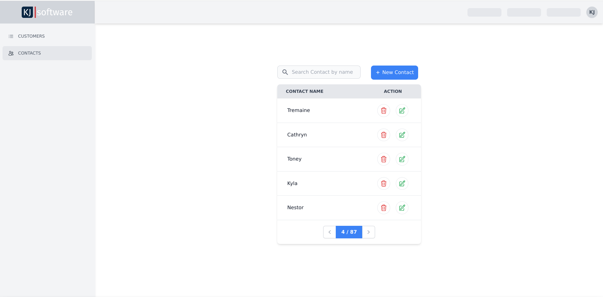
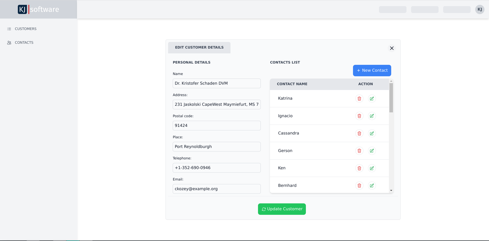

# Basic CRM application

This is a basic CRM system application built with Vue.js for the Frontend and Laravel for the API. It is designed to manage the interactions with customers and contacts. It typically includes features such as customer and contact management.
## Getting Started
These instructions will get you a copy of the project up and running on your local machine for development and testing purposes.

### Prerequisites

    PHP 8.2
    MySQL 5.7 or newer
    Composer
    Node.js v16.15 or newer

### Installing
1. Clone the repository and cd into it
```bash
git clone https://github.com/Alban-Kaperi/basic-crm
cd basic-crm
```
2. Install PHP dependencies
```bash
composer install
```
3. Copy the example environment file and generate an application key
```bash
cp .env.example .env
php artisan key:generate
```
4. Edit .env file and set up the database credentials with your own, example like below:
```makefile
DB_CONNECTION=mysql
DB_HOST=127.0.0.1
DB_PORT=3306
DB_DATABASE=database_name
DB_USERNAME=database_user
DB_PASSWORD=database_password
```
5. Migrate the database and seed some initial data
```bash
php artisan migrate
```
6. Seed some fake data to the database
```bash
php artisan db:seed
```
7. Install NPM dependencies and compile assets
```bash
npm install
npm run dev
```
8. Start the development server
```bash
php artisan serve
```
You should now be able to access the application at http://localhost:8000.or at the link that is consoled in your terminal


### Running the tests

To run the automated tests, run the following command:
```bash
php artisan test
```

### Some Screenshots





